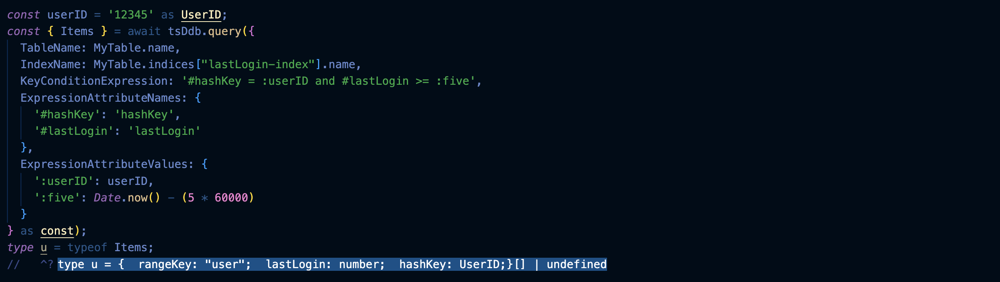

# ts-dynamodb

## Table of contents
- [Introduction](#introduction)
- [Installation](#installation)
  - [Prerequisites](#prerequisites)
- [Basic example](#basic-example)
  - [Raw client example](#using-the-raw-client-instead)
- [In depth example](#in-depth-example)
- [TypesafeDocumentClientRawv2](#typesafedocumentclientrawv2)
  - [get](#get)
  - [put](#put)
  - [update](#update)
  - [delete](#delete)
  - [query](#query)
  - [scan](#scan)
- [TypesafeDocumentClientv2](#typesafedocumentclientv2)
  - [createStrict*Item](#createstrictitem)
  - [updateSimpleSET](#updatesimpleset)
    - [createStrictUpdateSimpleSET](#createstrictupdatesimpleset)
- [Troubleshooting](#troubleshooting)
- [Opinionated decisions](#opinionated-decisions)
  - [TsDdbSet<...> and unknowable DynamoDBSets](#tsddbset-and-unknowable-dynamodbsets)
  - [Unknowable tuples and chaining up undefined](#unknowable-tuples-and-chaining-undefined-up-nested-objects)
- [Limitations](#limitations)
  - [Records](#recordstring--support-is-limited)
  - [Super long expressions](#super-long-expressions)
  - [query begins_with](#query-begins_with)

## Introduction

`ts-dynamodb` provides intelligent type inference on top of the familiar DynamoDB DocumentClient interface. The goal is to not have to learn a new API, write schemas in Javascript objects, or change anything about your existing queries.

After the initial table setup, simply assert your existing DocumentClient as a `TypesafeDocumentClientRawv2` and get correct types all throughout your project.

Since this package _currently_ only supports the `aws-sdk`, and I get tired of writing `.promise()` every time, there is a more full featured `TypesafeDocumentClientv2` that is mostly wrappers for the core methods (`get`, `put`, `update`, `delete`, `query`, and `scan`), but also provides a few more methods you may find helpful.

Please note, legacy parameters are not supported at all. `ConditionExpression` and `FilterExpression` support is limited. `DocumentClient.ConverterOptions` are also currently not supported - I'm hoping to add support for the `convertEmptyValues` and `wrapNumbers` options soon.

I welcome bug reports, suggestions, or comments! Please file an issue if you are inclined.

## Installation

### Prerequisites

- `typescript@4.9.4` (currently only tested on latest TS version)
- `strict` mode in `tsconfig.json` 

```
npm install ts-dynamodb
yarn add ts-dynamodb
```

Note: if you are only using the "raw" client (types only), it can be installed to `devDependencies` instead.

## [Basic Example](./examples/basicExample.ts)

```ts
import { DocumentClient } from "aws-sdk/clients/dynamodb";
import { TableFromValue, Table, TypesafeDocumentClientv2 } from "ts-dynamodb";

// Step 1: define your table types
type DBUser = {
  userID: string;
  username: string;
  email: string;
  name: string;
  created: number;
  updated: number;
};

// Step 2: create a readonly table object
// satisfies is not necessary, but may provide some type hints if adding indices
export const UserTable = {
  name: `users`
} as const satisfies TableFromValue;

// Step 3: create a table type
// the Table type takes 3 (or 4) arguments: 
// 1. a TableFromValue
// 2. a union of types in the table
// 3. the primary key
// 4. optionally, sort key
export type UserTableType = Table<typeof UserTable, DBUser, 'userID'>;

// Step 4: create the client
// the client takes one type argument:
// 1. a union of table types (one client can handle all of your tables!)
export const tsDdb = new TypesafeDocumentClientv2<UserTableType>(
  new DocumentClient({ region: 'us-east-1' })
);

// Use it as you normally would (but without having to call `.promise()`)

const { Item: userDetails } = await tsDdb.get({
  TableName: UserTable.name, // 'users'
  Key: {
    userID: '123' // string
  },
  ProjectionExpression: 'username, email, name'
} as const);
/**
  typeof userDetails = {
    username: string;
    email: string;
    name: string;
  } | undefined
 */
```

### Using the raw client instead
```ts
import { TypesafeDocumentClientRawv2 } from "ts-dynamodb";

// Replace Step 4 from above (step 1, 2, and 3 are the same in both)
// assert the DocumentClient as TypesafeDocumentClientRawv2, passing a union of table types as the only argument
export const tsDdbRaw = new DocumentClient({
  region: 'us-east-1'
}) as TypesafeDocumentClientRawv2<UserTableType>;

const { Item: user } = await tsDdbRaw.get({
  TableName: UserTable.name, // 'users'
  Key: {
    userID: '123' // string
  },
} as const).promise();
/**
  typeof user = TSDdbSet<DBUser, false> | undefined
 */
```

## [In depth example](./examples/inDepthExample.ts)
```ts
import { DocumentClient } from "aws-sdk/clients/dynamodb";
import { TableFromValue, Table, TypesafeDocumentClientv2 } from "ts-dynamodb";

// Can handle environment/stage dependent table and index names no problem
const stage = process.env.stage === 'test' ? 'test' : 'prod';

// Supports branded types
type UserID = string & { __brand: 'UserID' };
type PositiveNumber = number & { __brand: 'PositiveNumber' };
type User = {
  hashKey: UserID;
  rangeKey: 'user';
  created: number;
  updated: number;
  role: 'user' | 'admin';
  lastLogin: number;
  favoriteSites: SiteID[];
  numLogins: PositiveNumber;
};
type SiteID = string & { __brand: 'SiteID' };
type Site = {
  hashKey: SiteID;
  rangeKey: 'site';
  created: number;
  updated: number;
  url: string;
  categories: string[];
  config: {
    private: boolean;
    userBlacklist: DocumentClient.StringSet;
  };
};

// Step 1: we are also adding an index to this example. The indices object takes key strings and maps them to GSI or LSI index objects
export const MyTable = {
  name: `my-table.${stage}`,
  indices: {
    'lastLogin-index': {
      name: 'lastLogin-index',
      type: 'LSI',
      sortKey: 'lastLogin',
      project: 'keys-only'
    }
  }
} as const satisfies TableFromValue;

// Step 2
export type MyTableType = Table<typeof MyTable, User | Site, 'hashKey', 'rangeKey'>;

// Step 3
const tsDdb = new TypesafeDocumentClientv2<MyTableType>(
  new DocumentClient({ region: 'us-east-1' })
);

// And now we can use it in a nonsensical get, update, and query example

const userID = '12345' as UserID;
const { Item: user } = await tsDdb.get({
  TableName: MyTable.name,
  Key: {
    hashKey: userID,
    rangeKey: 'user'
  },
  ProjectionExpression: 'hashKey, rangeKey, favoriteSites[0], numLogins[0]'
} as const);
/**
  type user = {
    numLogins?: {     // oops, made an error, numLogins is not an array!
        "[0]"?: undefined;
    } | undefined;
    favoriteSites: SiteID[] | undefined;
    hashKey: UserID;
    rangeKey: 'user';
  } | undefined
 */
if (user) {
  const siteID = user.favoriteSites?.[0];
  if (siteID) {
    const updated = Date.now();
    const { Attributes: updatedSite } = await tsDdb.update({
      TableName: MyTable.name,
      Key: {
        hashKey: siteID,
        rangeKey: 'site'
      },
      ConditionExpression: '#hashKey = :siteID AND #rangeKey = :site',
      // We can add this user to the blacklist, and for some reason we also want to remove the first site category
      UpdateExpression: 'ADD config.userBlacklist :userID REMOVE categories[0] SET #updated = :now',
      ExpressionAttributeNames: {
        '#hashKey': 'hashKey',
        '#rangeKey': 'rangeKey',
        '#updated': 'updated'
      },
      ExpressionAttributeValues: {
        ':siteID': siteID,
        ':site': 'site',
        ':userID': tsDdb.createStringSet([userID]),
        ':now': updated // Try changing this to a string instead and see what happens
      },
      ReturnValues: 'UPDATED_NEW'
    } as const);
    /**
      type updatedSite = {
        categories: string[] | undefined; // note categories is returned as undefined. It will be undefined if we removed the one and only element in the categories array
        config: {
          userBlacklist: {
            wrapperName: "Set";
            type: "String";
            values: string[];
          };
        };
        updated: number;
      } | undefined;
     */

    // Let's also see if the user has tried to login since we banned them from their favorite site (oops)
    const { Items: partialUsers } = await tsDdb.query({
      TableName: MyTable.name,
      IndexName: MyTable.indices["lastLogin-index"].name,
      KeyConditionExpression: 'hashKey = :userID AND lastLogin > :now',
      ExpressionAttributeValues: {
        ':userID': userID,
        ':now': updated
      },
      Limit: 1
    } as const);
    const partialUser = partialUsers?.[0];
    if (partialUser) {
      console.log(`user '${partialUser.hashKey}' got a nasty suprise when they logged in at ${partialUser.lastLogin} and found they couldn't access their favorite site anymore 😕`);
    }
    /**
     * You only get back the attributes that exist on the index
     type partialUsers = {
        hashKey: UserID;
        lastLogin: number;
        rangeKey: 'user';
      }[] | undefined
     */
  }
}
```

## TypesafeDocumentClientRawv2

`TypesafeDocumentClientRawv2` is the types-only DocumentClient. If you don't want to change anything about your existing queries, this is the way to go. The following examples use the [`examples`](./examples/gif/index.ts) types and the `TypesafeDocumentClientv2`, but everything still applies (just tack on a `.promise()` or use the callback parameter).

### get

`get` will narrow the type of `Item` returned based on the `TableName` and `Key` you provide. Further refine your results with a `ProjectionExpression`. 

Validate that all `ExpressionAttributeNames` are used. Require `ExpressionAttributeNames` when any are present in the `ProjectionExpression`.

A `ProjectionExpression` can index into nested objects and arrays. Tuple ordering is preserved.


You'll probably notice in the example there's an extra type, `TSDdbSet`, surrounding `User`. There's a good reason for this. Please see [this](#tsddbset-and-unknowable-dynamodbsets) section as to why. Please also see the section on [DynamoDbSets](#dynamodbsets).

### put

`put` will validate the type of `Item` provided matches the combination of `TableName` and `Key` you provide. Forbid any extra keys in your object. 

Validate that all `ExpressionAttribute`s are used in the `ConditionExpression`. Require `ExpressionAttribute`s when any are present in the `ConditionExpression`. 

Return the actual type of `Attributes` when using `ReturnValues = 'ALL_OLD'`.


There are some caveats about detecting extra keys in objects. Please see [this](#detecting-extra-keys-in-objects) section as to why.

### update

`update` will validate all clauses in the `UpdateExpression` match the `Item` for the combination of `TableName` and `Key` you provide.

- SET values to their correct types (including support for list_append, increment/decrement, if_not_exists, and combinations of the three!)
  - ex: `'SET myStringArray = list_append(if_not_exists(myStringArray, :emptyList), :myStringArray)'` or `'set countTotal=:newStuff+#countOtherStuff'`.
- REMOVE fields that are optional or union'ed with undefined
- ADD a number field and number value, and ADD like-kind elements to a DynamoDbSet
- DELETE like-kind elements from a DynamoDbSet

Validate that all `ExpressionAttribute`s are used in the `UpdateExpression` and `ConditionExpression`. Return the correct type of `Attributes` when using 'ALL_NEW', 'ALL_OLD', 'UPDATED_NEW', or 'UPDATED_OLD'.


Here is an example using `list_append` and `if_not_exists`.


There are some caveats about detecting extra keys in objects for the SET clause. Please see [this](#detecting-extra-keys-in-objects) section as to why.

### delete

`delete` will validate that all `ExpressionAttribute`s are used in the `ConditionExpression`. Require `ExpressionAttribute`s when any are present in the `ConditionExpression`.

Return the actual type of `Attributes` when using `ReturnValues = 'ALL_OLD'`. 


### query

`query` will extract the type of `Items` in your table that will be returned using the provided `KeyConditionExpression`.

- Enhances the single-table design with `begins_with` support
- Supports extracting using all comparators: `=`, `<`, `<=`, `>`, `>=`, `BETWEEN`, and `begins_with`
- Understands the different index projection types (`'ALL'`, `'KEYS_ONLY'`, or `'INCLUDE'`) and what that means for the data returned
  - When querying using a Global Secondary Index, returns `undefined` for any fields included in a `ProjectionExpression` that are not included in the index's projection
  - When querying using a Local Secondary Index, allows you to project to all fields in the table, even if they're not included in the index (i.e., [fetches](https://docs.aws.amazon.com/amazondynamodb/latest/developerguide/LSI.html#LSI.Projections))
- Returns `never[]` when your KCE will not match any known types
- Catch bugs before runtime
  - Validate that the fields included in your KCE match the partitionKey/sortKey of the base table or index
  - Does not allow any comparison other than strict equality on the partitionKey of the base table or index




### scan

`scan` is similar to `query` in that it understands different index projection types and what that means for the data returned.


## TypesafeDocumentClientv2

With the non-types only client, everything about the core methods still applies from the a [TypesafeDocumentClientRawv2](#typesafedocumentclientrawv2) section. In exchange for not having to use `.promise()`, the `callback` parameter of the raw client is not supported.

### createStrict*Item

To abstract away a tiny bit of overhead (for the caller), `TypesafeDocumentClientv2` adds some additional "`createStrict[Put|Get|Update|Delete]Item`" methods. The syntax for these is slightly wonky (my apologies), but it's to workaround Typescript's current lack of [partial type inference](https://github.com/microsoft/TypeScript/issues/26242).

The syntax for the `createStrict*Item` methods is the following:

```ts
// 1. The curried function's argument is a table name. Call the function once.
// 2. It returns a function which takes no parameters, but must be provided with an Item that lives in the table (name) provided. Call this function.
// 3. The result is a function that can only get a `User`. Any `Key` that is not for a `User` will error.
const getUser = tsDdb.createStrictGetItem(MyTable.name)<User>();
const { Item: user } = await getUser({
  Key: {
    hashKey: userID,
    rangeKey: 'user'
  },
  ProjectionExpression: 'hashKey, rangeKey'
});
type u = typeof user;
//   ^? type u = TSDdbSet<User, false> | undefined
```

Everything else about the `createStrict*Item` methods is the same as described in the [TypesafeDocumentClientRawv2](#typesafedocumentclientrawv2) section.

### updateSimpleSET

A common operation is to update an object with new top level properties, such as updating a User's role, i.e. `type User = { ..., role: 'admin' | 'user' };`.

This method accepts an `Partial` of the `Item` with the provided `Key` (omitting the key fields themselves), and creates an `UpdateExpression` to `SET` the top level fields to a new value (only those that are not equal to `undefined`).

__IMPORTANT__: a `ConditionExpression` is also added using the `Key` fields and values. This method is intended to update _existing_ items only.
- You can add additional conditions using the optional `extraConditions` parameter. _DO NOT_ include `'AND'` in the suffix, it is added automatically.
  - The following example results in the `ConditionExpression` `'(#1 = :1 AND #2 = :2) AND #role = :user'`

What's with the numeric `ExpressionAttribute`s? To avoid conflicting with EAs you may want to use in `extraConditions`, each field and value in the `Item` is assigned an ascending EAN and EAV. These are used in the `UpdateExpression` and the `ConditionExpression`. (My apologies if you use ascending keys in your objects 🫠!)

One more option is `_logParams`. The goal of this library is to minimize the actual runtime code it's responsible for generating. This means that you get to control how you create the `params` object to all methods, which means you can log it if you want! With `updateSimpleSET`, you cannot control the params' creation, but providing `_logParams.log === true` will call Node's `util.inspect` on the generated parameters (pass an optional `message` as well to clearly identify which log it is).

For example:

```ts
const Item = {
  role: 'admin',
  lastLogin: Date.now()
} as const;
const { Attributes: updatedUserToAdmin } = await tsDdb.updateSimpleSET({
  TableName: MyTable.name,
  Key: {
    hashKey: userID,
    rangeKey: 'user'
  },
  Item,
  ReturnValues: 'UPDATED_OLD',
  extraConditions: {
    ANDSuffix: '#role = :user',
    extraExpressionAttributeNames: { '#role': 'role' },
    extraExpressionAttributeValues: { ':user': 'user' }
  },
  _logParams: {
    log: true,
    message: 'hello world'
  }
} as const);
type u = typeof updatedUser;
//   ^? type u2 = {  role: "user" | "admin";  lastLogin: number;} | undefined
```

#### createStrictUpdateSimpleSET

There is also a strict version of `updateSimpleSET`, because why not. It follows the same curried pattern described in [createStrict*Item](#createstrictitem).

## Helper types

`TypesafeDocumentClientv2` currently exposes two types that you may find useful.

- `GetTableItemKey<TableType, Item>`
```ts
type k = GetTableItemKey<MyTableType, User> = { rangeKey: "user"; hashKey: UserID };
```
- `StrictSimpleUpdateSETItem<TableType, Item>`
```ts
type u = StrictSimpleUpdateSETItem<MyTableType, User> = {
    name?: string | undefined;
    lastLogin?: number | undefined;
    role?: "user" | "admin" | undefined;
    email?: string | undefined;
    created?: number | undefined;
    updated?: number | undefined;
    username?: string | undefined;
    favoriteSites?: SiteID[] | undefined;
    numLogins?: PositiveNumber | undefined;
  }
```

## DynamoDbSets

In order to use sets in your types, they _must_ be defined as `DocumentClient.DynamoDbSet`s. Specifically, they must be defined as the _specific_ type of DynamoDbSet you wish to use. (DynamoDbSets do not support mixed types, so it must be a `DocumentClient.NumberSet`, `DocumentClient.StringSet`, or `DocumentClient.BinarySet`.) When using `TypesafeDocumentClientv2`, there are helper methods that assert the type returned from `DocumentClient.createSet` as a `StringSet`, `NumberSet`, or `BinarySet` types: `createStringSet`, `createNumberSet`, and `createBinarySet`, respectively. They all support `DocumentClient.CreateSetOptions`.

When using the raw client, you must assert these types yourself as the output from `DocumentClient.createSet`.

## Troubleshooting

- Make sure to _always_ use `as const` for method params! For example, a string that is meant to be a constant in `update` `ExpressionAttributeValues` will be widened to simply `string` without it. This also may bite you for `put` and `query`.
- The `Key`s of the `Item` types in a table _must_ be a discriminated union. If two objects have the same `Key`, you may get errors, especially for `put` and `update`.
- `update` increment/decrement and number `ADD`
  - The values you try to increment or decrement using `SET` or number values you try to `ADD` must be `number`s or a branded type intersected with `number`. If you have a value that is a constant number, it cannot be modified. By constant, I mean something like `num` in `type a = { num: 7 }`. So `SET num = num + num` will not work.
- Make sure `list_append` is receiving arrays for both operands.
- The `ExpressionAttributeValues` for `ADD` and `DELETE` for DynamoDbSets must be DynamoDbSets themselves.

## Opinionated decisions

### TsDdbSet<...> and unknowable DynamoDBSets

All `DynamoDbSet` are union'ed with `undefined`, except when using `ReturnValues = 'UPDATED_NEW'` for the `SET` and `ADD` clauses targeting a `DynamoDbSet` (they'll exist after the update because we set a new one or added to an existing one _or_ DynamoDB created a new one if it didn't exist). 

This is because `DynamoDbSet`s cannot be empty. If they become empty through the `DELETE` clause, they cease to exist. Since it is unknowable what the state of a `DynamoDbSet` is in the DB, the safest, if slightly more inconvenient, option is to be open to the possibility that they will be `undefined` in the response. `TsDdbSet` is a recursive mapped type that does just that: adds `undefined` to a union with DynamoDbSets.

### Unknowable tuples and chaining undefined up nested objects

What is the tuple returned if the `ProjectionExpression` is `tup[0].a, tup[1].a` and `tup[0] === {}` for the following type?

```ts
type tup = { tup: [{ a?: "a"; b?: "b" }, { a: "a" }] };
```

Unfortunately, it is `[{ a: "a" }]`. In situations like this, `tup` will become `unknown[] | undefined` (because if `tup[0] === { a: "a" }` instead, the tuple is of length 2). This does not affect your ability to update `tup` in an `UpdateExpression`, but does affect what the `tup` is typed as when returned in a `ProjectionExpression` or `update` `ReturnValues = 'UPDATED_OLD' | UPDATED_NEW'`.

A similar situation arises for nested objects. If all properties in an object are potentially undefined, DynamoDB will not return an empty object, it won't return an object at all! This means that the field whose value is this "potentially entirely undefined object" must have `undefined` added as a possible value. This continues recursively up to the top-level fields of the object.

```ts
type obj = { topLevel: { a?: string; b?: number } };
// when obj is returned in a get, for example, even without a ProjectionExpression, it becomes:
type objReturned = { topLevel: { a: string | undefined; b: number | undefined } | undefined };
```

For more information on unknowable types, see the companion bullet point in [Limitations](#limitations).

## Limitations

- `ConditionExpression`s and `FilterExpression`s are not parsed for anything except that all ExpressionAttributes are used. The goal is to add full support for understanding CEs and FEs soon.

Hopefully the rest of these will be relatively uncommon problems to run into.

- `Key`s of all `Item`s in your table _must_ form a discriminated union. If you try to use two types with indistinguishable keys, you will run into errors. For example:
  ```ts
  type Item1 = { hashKey: string, .../** things that differ between Item1 and Item2 **/ };
  type Item2 = { hashKey: string, ... };
  type MyTableType = Table<typeof MyTable, Item1 | Item2, 'hashKey'>; // unpredictable and unsupported behavior 
  ```

- Similar to `DynamoDBSet`s, there are certain types that become unknowable what their state is once inserted in the DB. Specifically, sparse tuples and rest arrays with rest elements that do not fall in the last position. If you try to use these types in a type in a table's types union, you will get an error (it will let you know that you've introduced these to your types, and will force you to change them to use the library). Here are examples of such types:

  ```ts
  type sparseTuple = [number, number?, string?]; 
  ```
  If index `1` is inserted as `undefined`, what is the length of this tuple? Because undefined is not a valid value in DynamoDB land, this becomes `[number, string]` in the DB. Hmm, that doesn't seem good... This quickly spirals out of control the larger and sparser the tuple can be.

  ```ts
  type startingRestArray = [...number[], string]; 
  ```
  Err, wait, if there are no numbers in this array, and you try to use a `ProjectionExpression` to get the zero element, what is the type? `number` or `string`? This quickly becomes for all intents and purposes a (string | number)[] array. All of these issues can be avoided if the rest element is the final element in the array, because we have a knowable number of starting, unchanging, ordered elements at the beginning of the array.

- When using `'UPDATED_NEW'` `ReturnValues`, if `SET`ting a non-rest element and removing a rest-element from the same array, the array is union'ed with `undefined`, even though we know we `SET` a _for sure_ defined value, and thus the array will be returned.

- Inner discriminated unions _will_ cause unpredictable behavior and are not supported. Here's what I mean by "inner discriminated unions":
  ```ts
  type IDU = {
    base: 'thing';
  } & ({
    type: 'a';
    thing: number;
  } | {
    type: 'b';
    thing: string;
  });
  ```
  - Please make your `Key` types discriminated unions instead.
  - Perhaps with some smarter types, there may be a way to intelligently preserve the discriminated union when using a `ProjectionExpression`, and even more tricky, when using an `UpdateExpression` (would have to involve a `ConditionExpression` I'd think). If you have any suggestions, please let me know! I'd love to hear your thoughts.

### `Record<string, ...>` support is _limited_

I'm hoping to add support for these use cases ASAP!!!

`UpdateExpression` `SET` currently _will not_ work for Record types. For example,
```ts
type thing = { thing: Record<string, any> };
// This will not work
const UpdateExpression = `SET thing.anyArbitraryKey = :anyArbitraryValue`;
```

The set of valid `ExpressionAttributeNames` values is generated by a helper type to get all keys in a type (you may have noticed some cool intellisense in the gif examples). Unfortunately, this is diluted by index keys (i.e. `Record<string, unknown>`). Including these types dilutes the value set to simply `string`. There's no way to have good intellisense on these values if they're included in a type (a Typescript limitation). If I exclude all index keys (`string`), then arbitrary values couldn't be used _at all_ in `ExpressionAttributeNames`. For example, 
```ts
Record<`#${string}`, string | 'key1' /* | ...etc */>
```
reduces to simply
```ts
Record<`#${string}`, string>
```

`ProjectionExpression`s into `Record`s with `string` keys will be unreliable. Here's an example of an unsupported `ProjectionExpression` into type `{ record: Record<string, any> }`:
```ts
'record.prop'
```
- The above `ProjectionExpression` _will_ work on a type `{ record: Record<'prop' | 'key', any> }`, yielding `{ record: { prop: any } }`.

### Super long Expressions

If an Expression (Project, Update, or KeyCondition) is more than 1000 characters long, I'm running into Typescript's recursion limit. This is solely to remove newlines, tabs, and in some cases spaces from these Expressions to parse them properly.
- Workarounds:
  - Omit newlines, tabs, and spaces when possible. It definitely helps with readability to split long expressions over multiple lines, so I apologize for this restriction.
  - Use shorter `ExpressionAttributeNames` or `ExpressionAttributeValues`. Again, this sacrifices readability 😕, but per the [docs](https://docs.aws.amazon.com/amazondynamodb/latest/developerguide/Expressions.Attributes.html#Expressions.Attributes.NestedElements.DocumentPathExamples), there are `a-z + A-Z + 0-9 = 26 + 26 + 10 = 62` one letter names you can use, so that's a start (hopefully 😅, for your needs).

### `query begins_with`

`begins_with` explanation: (`field` refers to the sort key attribute of an index)
  
- The first check is if `string extends type[field]`. This is only true if `type[field]` is simply `string`. There's no other information we can capture, but we can say this is true, because there _could_ be a string(s) in the collection that begin with whatever value you specified.
- The second check is `:eav extends type[field]`, so this can capture a scenario like if the `:eav` is `id_8`, and `type[field]` is `id_${number}`.
- The third check is `type[field] extends ${:eav}${string}`, so depending on how specific the :eav value is, this condition may or may not be true. For example, if the `:eav` is `id_8`, and the `type[field]` is `id_${string}-${string}-${string}-${string}` (a _very_ loose representation of a UUID), one reason this condition will fail because there's no guarantee that the character after the `_` in `id_${string}-${string}-${string}-${string}` will be `8`! This check is mainly designed to find exact matches of a template literal type EAV if that EAV comes from function arguments, for example.
- At least for my use case, this will be useful to query for a sortable key with a timestamp, for example a user's video chats, something like partitionKey=UUID and sortKey=`video_call_${number}`. In this type of situation, I'd set the sortKey KeyCondition to `begins_with(sortKey, 'video_call_')` to get all a user's video chats.
- For the curious, that's the algorithm, and hopefully there won't be too many situations where you run into a type it can't extract. (If you do, let me know!)

### Detecting extra keys in objects

For the most part, this library can detect when extra keys are included in objects you wish to `put` or `update`. However, there are scenarios where this is not possible due to some TS limitations.

1. Because TS is [structually typed](https://www.typescriptlang.org/play#example/structural-typing), if, for example, the `Item` to `put` comes from a function argument, there is no guarantee that the `Item` will not include any extra keys.
2. There seems to be a TS bug affecting the type I use to detect extra keys: [#52267](https://github.com/microsoft/TypeScript/issues/52267). This should only arise for uncommon types.